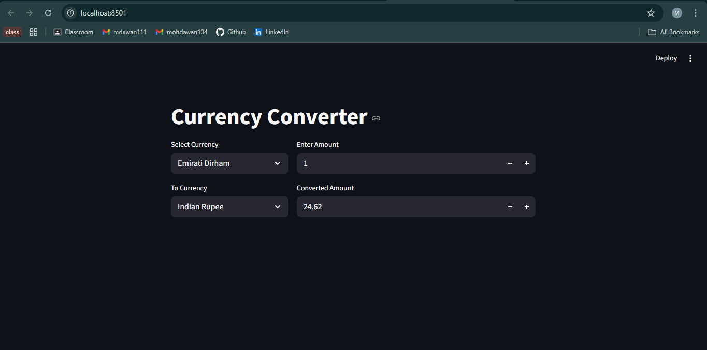

# 💱 Currency Converter

A simple and user-friendly **Currency Converter** application that allows users to convert amounts between different currencies using real-time exchange rates.

This project demonstrates my abilities for the following:-

- API integration
- Clean Python logic
- Basic error handling

---

## 🚀 Features

- Convert currency from one type to another
- Supports multiple international currencies
- Uses real-time exchange rate data


---

## 🛠️ Tech Stack

- **Language:** Python  
- **API:** Exchange Rate API by https://github.com/fawazahmed0/exchange-api  
- **Libraries:** `requests`, `streamlit`

---

## 🧠 How It Works

1. User enters:
   - Base currency
   - Target currency
   - Amount
2. The application fetches the latest exchange rate from an external API
3. Converted amount is calculated and displayed to the user

---

## ▶️ How to Run the Project

### 1️⃣ Clone the Repository
```bash
git clone https://github.com/MohammedAwan/Currency-Converter.git
```

### 2️⃣ Navigate to the Project Directory
```bash
cd Currency-Converter
```

3️⃣ Install Dependencies
```bash
pip install -r requirements.txt
```

4️⃣ Run the Application
```bash
streamlit run .py
```
## 📸 Screenshots





